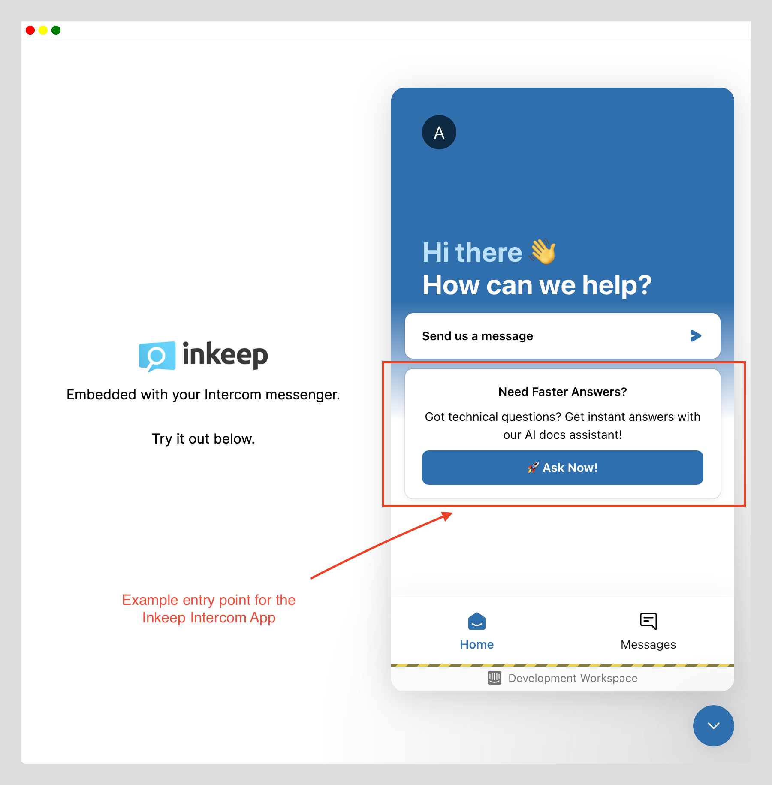
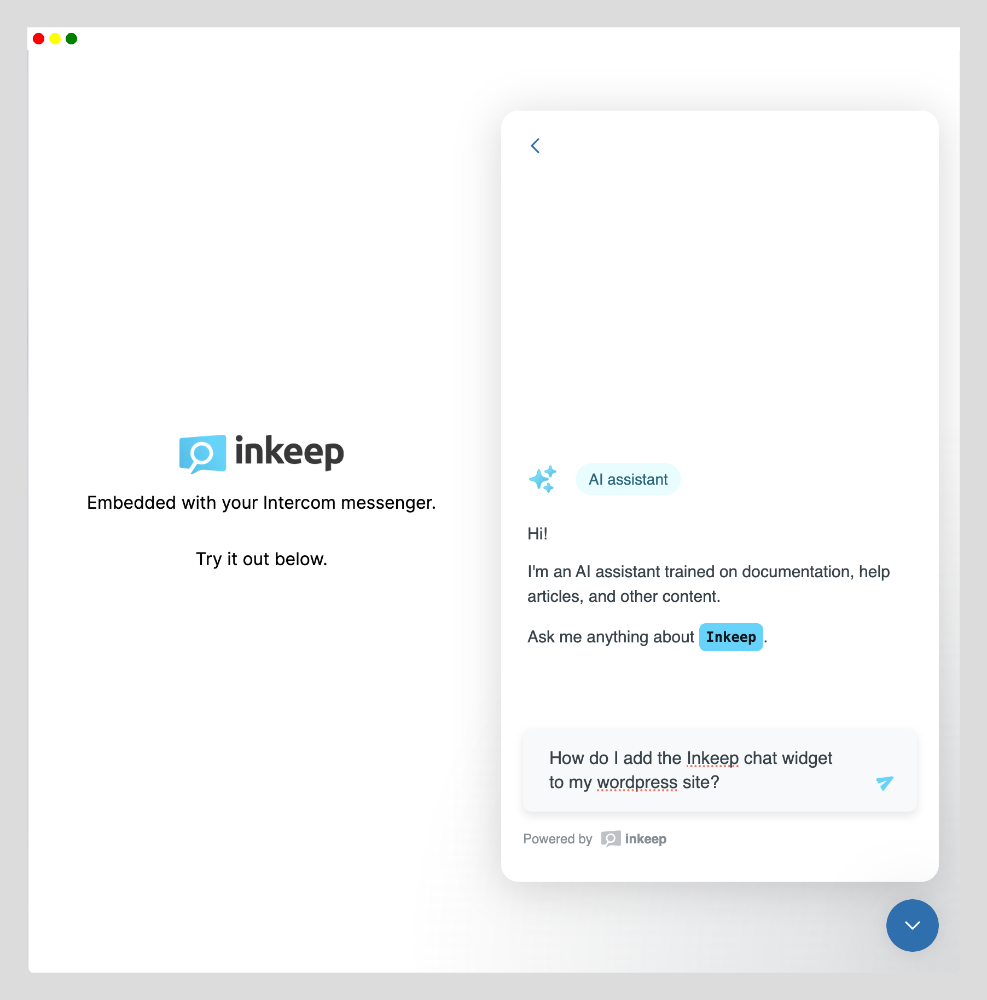
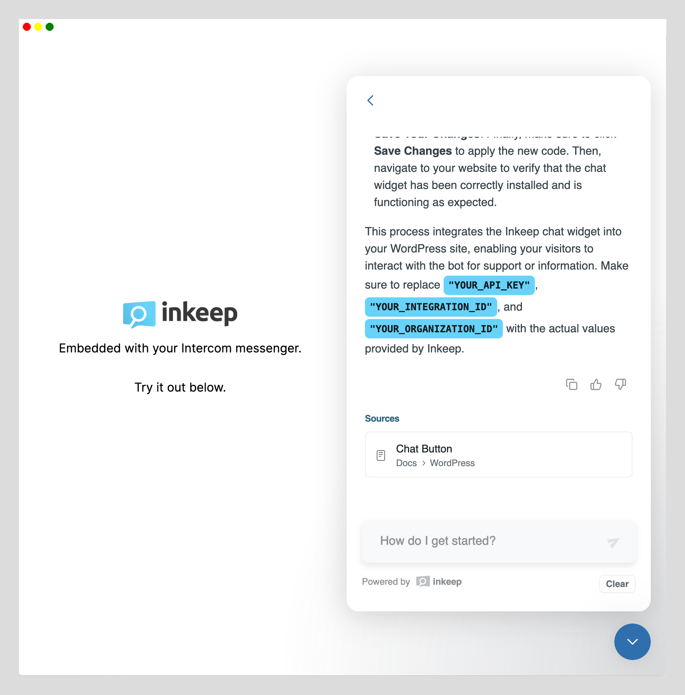

# Inkeep Intercom Application Template

This repository demonstrates how to integrate Inkeep's AI Documentation Chat widget within your existing Intercom messenger. This is ideal if you don't want to stop using Intercom and you don't want two different messenger widgets on your web page. 


## Live Demo:
[Try a live demo using Inkeep's Intercom and Inkeep's docs here](https://inkeep-within-intercom.vercel.app/)





## Set up instructions

High level:
- 1-click deploy an app to Vercel. This app has the logic needed for the Intercom widget to talk to the Inkeep app. [Let us know](mailto:support@inkeep.com) if you use a different cloud provider
- Configure the Inkeep app in the Intercom dashboard to be used by the widget

### Deploy to Vercel
[](https://vercel.com/new/clone?repository-url=https%3A%2F%2Fgithub.com%2Finkeep%2Finkeep-within-intercom&env=NEXT_PUBLIC_INTERCOM_APP_ID,INKEEP_API_KEY,INKEEP_INTEGRATION_ID,INKEEP_ORGANIZATION_ID,INKEEP_ORGANIZATION_DISPLAY_NAME,INKEEP_PRIMARY_BRAND_COLOR&envDescription=API%20Keys%20and%20configuration%20needed%20for%20setting%20up%20the%20Inkeep%20Chat&envLink=https%3A%2F%2Fdocs.inkeep.com%2Fintegrations%2Fnextjs%2Fembedded-chat%23get-an-inkeep-api-key&project-name=my-inkeep-intercom-app&repository-name=my-inkeep-intercom-app)

1. **Click "Deploy to Vercel"**:
   - [](https://vercel.com/new/clone?repository-url=https%3A%2F%2Fgithub.com%2Finkeep%2Finkeep-within-intercom&env=NEXT_PUBLIC_INTERCOM_APP_ID,INKEEP_API_KEY,INKEEP_INTEGRATION_ID,INKEEP_ORGANIZATION_ID,INKEEP_ORGANIZATION_DISPLAY_NAME,INKEEP_PRIMARY_BRAND_COLOR&envDescription=API%20Keys%20and%20configuration%20needed%20for%20setting%20up%20the%20Inkeep%20Chat&envLink=https%3A%2F%2Fdocs.inkeep.com%2Fintegrations%2Fnextjs%2Fembedded-chat%23get-an-inkeep-api-key&project-name=my-inkeep-intercom-app&repository-name=my-inkeep-intercom-app)

2. **Get variables**:
   -  `NEXT_PUBLIC_INTERCOM_APP_ID` is the Intercom workspace ID. [Learn how to find your App ID here](https://community.intercom.com/messenger-8/where-i-can-get-my-app-id-4021).
   - `INKEEP_API_KEY`, `INKEEP_INTEGRATION_ID`, `INKEEP_ORGANIZATION_ID` are the API keys for the Inkeep API. [Learn how to get your API keys here](https://docs.inkeep.com/integrations/nextjs/embedded-chat#get-an-inkeep-api-key).
   - `INKEEP_ORGANIZATION_DISPLAY_NAME` is the name of your organization as it should appear in the chat interface (e.g., "Acme Corp").
   - `INKEEP_PRIMARY_BRAND_COLOR` is the hex color code for your brand's primary color (e.g., "#26D6FF").

3. **Complete the vercel deployment**. Get the deployment domain, e.g. `myinkeepintercomapp.vercel.com`)

### Configure in Intercom

4. **Create and configure a new Intercom App**:
   - Configure the new app:
     https://developers.intercom.com/docs/build-an-integration/getting-started/build-an-app-for-your-messenger/#add-the-webhooks 

     - Initialize flow Webhook url:  `{ Vercel Deployment Domain}/api/initialize` 
     - Submit flow Webhook url:  `{ Vercel Deployment Domain}/api/submit` 

5. **Configure the messenger to display the app**.
   - Follow this guide to add your new app to the messenger: [Customize your messenger home with apps](https://www.intercom.com/help/en/articles/1827291-customize-your-messenger-home-with-apps)
  
6. **Test it**.
   - Go to a page where your intercom messenger is shown or open your vercel deployment homepage to give it a test drive.

*Optional*
- Customize the Inkeep-Intercom app using elements from the [Intercom Canvas Kit](https://developers.intercom.com/docs/canvas-kit) and redefining the canvas object within the initlialize endpoint.
- Conditionally show/hide the Inkeep Intercom app based on various user and visitor properties.

## Local Development

First, run the development server:

```bash
npm run dev
# or
yarn dev
# or
pnpm dev
# or
bun dev
```

Open [http://localhost:3000](http://localhost:3000) with your browser to see the result.
